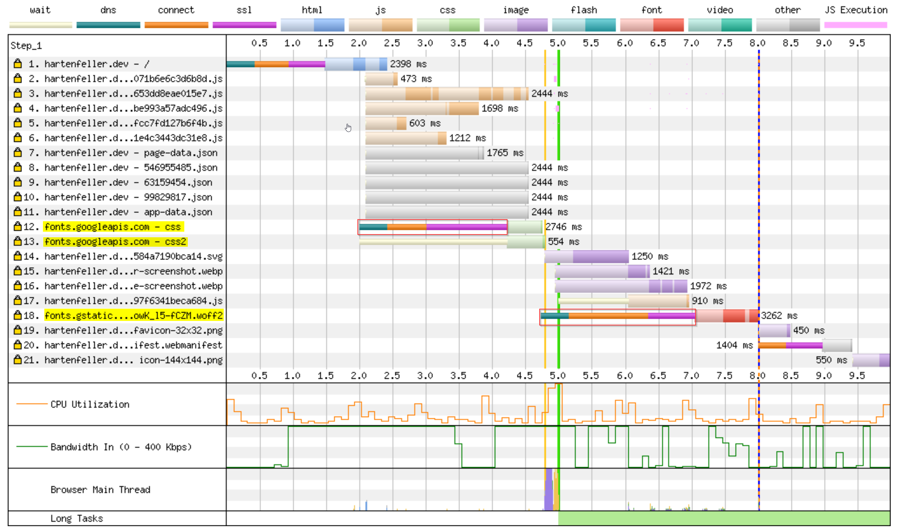

Jake Archibald has a [super interesting blog series where he analyzes the performance of webpages of Formula 1 teams](https://jakearchibald.com/2021/f1-perf-part-1/).

One thing that struck me was loading content from a different server than the main server be pretty costly because setting up a new connection with a new server can take some time. Jake Archibald described this in more detail [here](https://jakearchibald.com/2021/f1-perf-part-1/#avoid-blocking-resources-on-other-servers).

In an ideal scenario where the user device is powerful and has a perfect cable internet connection this is not really a problem. But this is not always the case as lowend phones and bad mobile internet is not uncommon (especially in Germany...).

## Loading Fonts from Google

On my website (this one you are currently reading) I used to load custom fonts from [Google Fonts](https://fonts.google.com/). This is super easy to setup you just need to set some CSS:

```css
@import url('https://fonts.googleapis.com/css?family=Merriweather&display=swap');

.text-merryweather {
  font-family: 'Merriweather', 'serif';
}
```

## The impact

This is super easy to setup but has the downside that this font is loaded from a different source.

To measure the exact impact I used [WebPageTest](https://www.webpagetest.org/) (like Jake Archibald) which gives deep insights on what takes how long to load.

I used the default device (Motorla G4) and set the network speed to slow 3G to **test the impact in worst conditions**.

The results are the following:



As you can see these fonts actually cause two connections to different servers. Rows 12, 13 and 18 are the ones caused by the fonts. The interesting part is the on I highlighted in red borders. This is exactly the cost of an additional connection consisting of a DNS lookup, the connection itself and establishing an SSL encrypted connection.

Added together these connection buildups cost around 4 seconds of the total of 10 seconds. This is very much for just some fonts.

## Selhosting the fonts

I quickly found the tool [google-webfonts-helper](https://google-webfonts-helper.herokuapp.com/) that makes it easy to setup selhosting for these fonts.

You can choose your desired font, select the needed styles and it gives you CSS you can put into your page and an download for the actual font files that you need to host.
